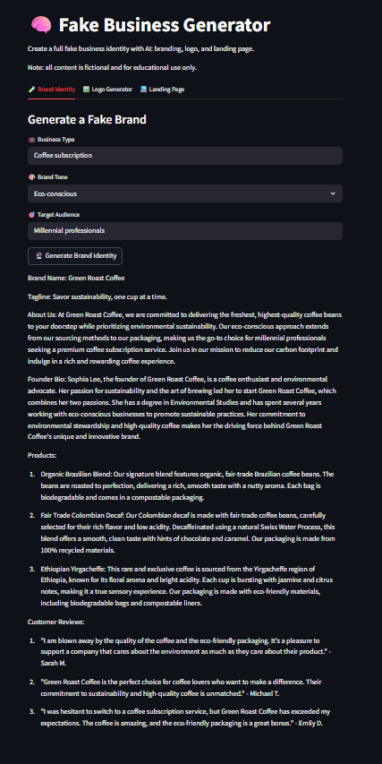

# 🧠 Fake Business Generator

This is a Streamlit-based app that demonstrates how AI can be used to generate convincing fake businesses — including brand identities, product descriptions, landing pages, and logos. It highlights both the creative power and potential risks of generative AI.



## ⚠️ Ethical Considerations & Risks
This project demonstrates how AI can convincingly fabricate a business identity — including names, slogans, websites, products, and even logos — with minimal human input. While this showcases the creative and generative power of modern AI systems, it also highlights a range of potentially harmful applications, such as:

### 🛑 Potential Risks:
- Scams and Deception: Malicious actors could use similar tools to create fraudulent websites or products that deceive consumers or investors.
- Phishing and Social Engineering: Fake businesses can be used as fronts for collecting personal information or spreading malware.
- Disinformation: AI-generated businesses and products can be used in coordinated influence campaigns to create false narratives, fake endorsements, or spread misinformation.
- Brand Impersonation: AI-generated content might inadvertently imitate or closely resemble real brands, leading to reputational damage or legal issues.

### 🔍 Why It Matters:
As AI becomes more accessible and powerful, the barrier to creating believable fake content is lower than ever. Demonstrating these capabilities is essential to:

- Raise awareness among developers, policymakers, and the public
- Inform safeguards for online platforms and marketplaces
- Encourage responsible use and regulation of generative technologies

### 🧭 Responsible Use
This tool is intended for educational and research purposes only. It is designed to spark critical conversations around:
- The ethics of synthetic media
- The need for AI detection tools and provenance systems
- How we can design AI systems that are robust against misuse

We strongly discourage using this tool or its derivatives in any context that could cause harm, mislead, or defraud others.

## Features

- **AI-Generated Brand Identity**: Name, slogan, and tone based on business type and style
- **Product/Service Generator**: Fake offerings with persuasive descriptions
- **Landing Page Creator**: HTML output mimicking real startup pages
- **Logo Generator**: AI-generated logos via Hugging Face image models

---

## 🚀 Getting Started

### 1. Clone the repository

### 2. Install dependencies

```bash
pip install -r requirements.txt
```
> Ensure you're using Python 3.8+ and have `streamlit` and `huggingface_hub`.

### 3. Setup environment variables

Create a `.env` file in the root with:

```env
hf_token=your_huggingface_api_token
```

This token must have access to models like:
- `HuggingFaceH4/zephyr-7b-beta` (text generation)
- `runwayml/stable-diffusion-v1-5` (image generation)

### 4. Run the app

```bash
streamlit run app.py
```

---

## 🔧 Project Structure

```
├── app.py               # Main Streamlit app
└── README.md
```

---

## 🛠 Models Used

| Purpose              | Model Used                          |
|----------------------|--------------------------------------|
| Brand + HTML Text    | `HuggingFaceH4/zephyr-7b-beta`       |
| Logo Generation      | `runwayml/stable-diffusion-v1-5`     |

---

## ⚠️ Disclaimer

This app was created for **educational and awareness purposes only**. It shows how AI can be used to convincingly generate fictitious brands and products. Do not use this tool to deceive, mislead, or engage in unethical behavior.

---

## 📄 License

MIT License

---

## 👥 Authors

Built by Meru A. using Streamlit and Hugging Face APIs.